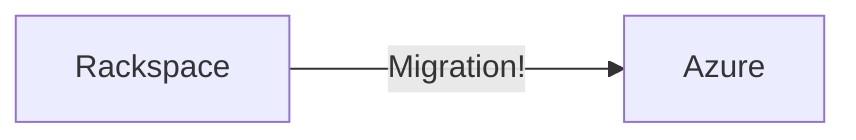
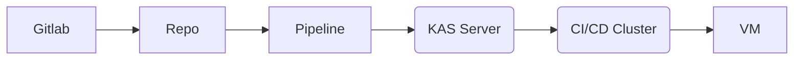

# ThirtyThreeGlobal.com Projects

My time at ThirtyThree has allowed me to cover a very wide gamut of projects that have touched on every area of the DevOps world. This is a brief summary of the major milestones during those years.

## Infrastructure Migration

When I joined ThirtyThree, it had been recently purchased by Capita. One of the first major projects was to complete a full transfer of all the existin systems, services, and virtual machines from our current cloud-host, Rackspace, to a Capita-owned Azure subscription through the implementation of Terraform and our existing full Puppet IaC solution.

---

## Upgrade Path

Our main CMSes and codebase is built upon Laravel and Concrete5 that both required a stable LAMP stack to run - which is why CentOS7 was the logical choice at the time. However, since the December 2020 discontinuation of CentOS and betrayal of Redhat, the descision was made to move onto the Rocky operating system. 
I was tasked with planning and building both the hardware on Azure and upgrading puppet to install the latest versions of the Lamp stack that we could maintain. 
Our developers also needed an upgrade from the archaic VirtualBox and Vagrant systems since the newer Apple M-Series laptops became more and more difficult to run - therefore the upgrade also involved migrating from VirtualBox+Vagrant to Orbstack.

---

## Verion Control and CI/CD

Our self-hosted GitLab installation regularly required upgrades and updates, as well as security checks and personnel upkeep.
As the ThirtyThree developer team requirements grew and our clients needs expanded, I was tasked with starting to implement a CI/CD pipeline solution within our Gitlab instance. Many of the developers had used Github Actions before and there was a need to start building pipelines and scheduled tasks to facilitate regular jobs, deployments and new systems. 
I put together the GitLab KAS Server using a self-hosted kubernetes cluster in Azure and configured our Gitlab-runners to run on this new infrastructure. We also have evolved our main software offering, dubbed 'Mercury', to implement a CI/CD deployment process that utilises on-machine gitlab-runners as well. This speeds up deployment time and ease of use of the pipeline jobs.

---

## Developer Deployment

Our legacy systems revolve around our central custom single-source-of-truth that holds all of of website metadata from Redirects to SSL Certificates, vHost details and deployment history.
This data is updated onto the servers every 30mins and our Puppet Code will read it and update the servers if required with the new changes. This allows us to keep all the servers synchronised and inline. An ongoing task for me was ensuring that any issues for the developers regarding deployments, certificates or any other part of the system were addressed and fixed. Sometimes the system needed extending as the systems evolved and grew.

---

## Test Pipelines
Once we had a fully-fledged pipeline system within GitLab, a large project was started to build a testing suite to enable one-off and scheduled runs of many different tools from OWASP, Lighthouse, Link checking, Browser Testing, Unit testing and many more. The primary one, the OWASP and security testing on our staging servers give us the reassurance that our clients can perform their own tests and security checks and have no major issues come to light.
The task required me to build each of the pipelines, both automated and manual-running, and use shared pipeline definitions that built and rendered gitlab-pages outputs that could be read and monitored. 

---

## Estate Monitoring
As the estate grew, monitor was required. We installed, developed and evolved a Prometheus / Loki / Grafana solution with custom dashboards, tripwires and alerting for daily, weekly and monthly monitoring reports. Learning and understanding PromQL to develop the dashboards was a must, as well as getting to grips with all the exporters that run on the servers - GrokExporter / NodeExporter / etc... Building up the GROK / REGEX patterns and parsing many log files for metrics and log ingestation into both Loki and Prometheus. 

---

## Cloud Mangement
Once in Azure, my role was to manage the infrastructure and build upon it. My first job was to ensure the security of the infrastructure - which meant building out the subscription NSGs (Network Security Groups) that would complement the VM (iptables) Firewalls. However, as many of you know about the digital landscape these days, protection from DDOS and many other attacks has grown and therefore building the App-Gateway and utilising Azures IP-Based DDOS protection has also come into effect.

Besides the protection side of the Infrastructure, ThirtyThree has multiple networks across the globe requiring access to each other, Application-Gateways, Kubernetes Clusters, ACR, Vaults, Multi-region subnets and many more services. These initially were terraformed from a single mono-repo of all services, however have been migrated into many single repos using GitLabs' terraform state and module features.

---

## Disasters and Incidents
Our wonderful consultant and mentor, [John Arundel](bitfieldconsulting.com) (Who literally wrote the book about Cloud Dev-Ops / Puppet / Go and many others), wrote a wonderful article for uptime.com that demonstrates how we prepare for incidents and disasters. You can read it here:  [Got Game? Secrets of Great Incident Management](https://uptime.com/blog/got-game-secrets-of-great-incident-management)

I Lead our incident response training and (Red-Team / Blue-Team) game-days to help prepare the digital team and company for disaster management and recovery procedures. Also ensure that we had a robust multi-tenant backup solution for all major services and client data. We required custom scripts and debugging tools for many scenarios involving DDOSing, security testing, system failure and resource saturation.

---

## Kubernetes
The future of the ThirtyThreeGlobal infrastructure is to move onto a container-based system. I was tasked with learning, developing and building that infrastucture. This started with translating our existing tech-stacks into docker containers for local development and moved into rebuilding our deployment processes into a full Gitlab CI/CD Pipeline. The virtual machines would then be moved to a brand new Kubernetes Cluster and Azure Container Registry. Our unique needs of database migrations/deployment, DNSing, Certificate management and client requirements made this a complex, yet fun proof-of-concept system.

to Docker Containers, AKS Kubernetes Clusters, Azure ACR and GitLab CI/CD deployments. 

---

## Other Services
Alongside the core infrastructure I built, maintained or managed our other services which included a lot of BASH/Shell scripting, PagerDuty, Uptime-Robot/Uptime-Kuma, SSL certificates and CSR Requests, Our custom DNS solution and 'Redirector' service, Secrets Managment system, Documentation and Wiki accuracy.