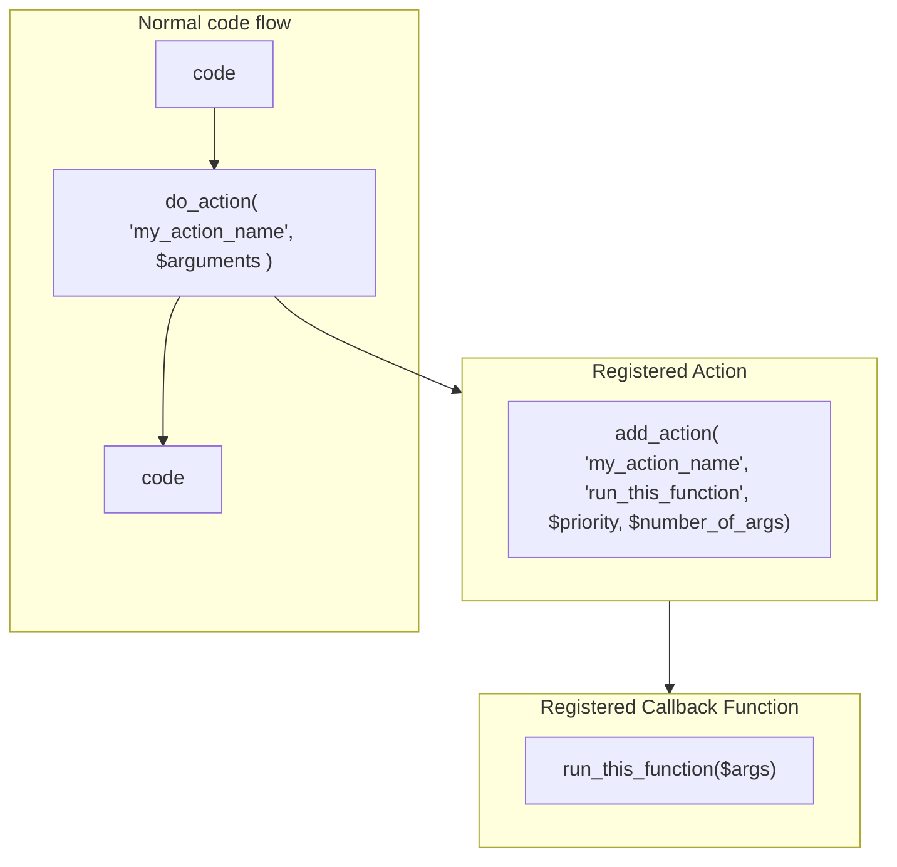
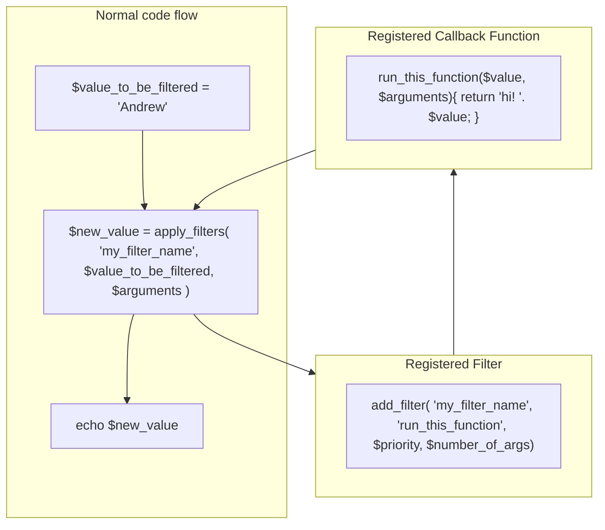

# Wordpress Simple Actions & Filters

Curse the gods, this simple functionality can seem complicated. I think its a combination of the terminology and word choice being so unhelpful. Do I `add` , `apply` or `do` a filter or action? What is a hook here? Or maybe I need to register it? It's all very vague, and I constantly forget.

Anyway, here's some pretty pictures instead. I've made it as basic as possible, more for remembering which one to use and where.

## 🧗🏻‍♀️ Basic Actions (does a task, returns nothing)

Plug in new code at a specific point.

1.  Once you've registered your action with a `my_action_name` in functions.php or a plugin, you can now call it. 
    
2.  Whenever the code gets to a `do_action('my_action_name')`, it'll  run the associated callback function `run_this_function`.  
    
3.  No need to return anything.

🔗 Action Links:

[https://developer.wordpress.org/reference/functions/do_action/](https://developer.wordpress.org/reference/functions/do_action/)

[https://developer.wordpress.org/reference/functions/add_action/](https://developer.wordpress.org/reference/functions/add_action/)

## 🔍 Basic Filters (returns filtered data)

Pass in a value, change the value, pass new value back.

1. Registered your filter with an `add_filter` referencing a callback function.
2. Run the filter with the `apply_filter` function.
3. The callback function will take the passed value, change it and return it back. (filtering it)
4. MUST return something (the new value).

#### 🔗 Filter Links:

[https://developer.wordpress.org/reference/functions/apply_filters/](https://developer.wordpress.org/reference/functions/apply_filters/)

[https://developer.wordpress.org/reference/functions/add_filter/](https://developer.wordpress.org/reference/functions/add_filter/)

